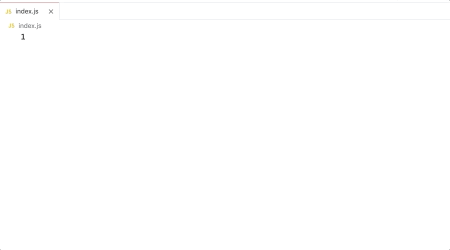
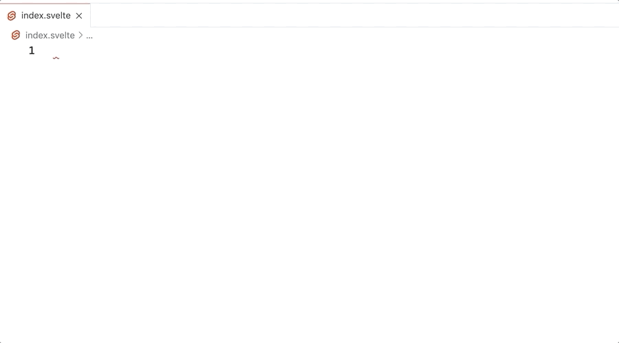

# Your Snippets

These are some convenient snippets to use in your everyday coding life.

Includes snippets for use in [JavaScript](https://developer.mozilla.org/en-US/docs/Web/JavaScript), [TypeScript](https://www.typescriptlang.org/), and [Svelte](https://svelte.dev/).

## JavaScript and TypeScript snippets

### conc

Creates a `console.log` with what you type expanded as both a variable and a string with the same text.

```javascript
console.log("variable", variable);
```



### desc

Creates a `describe` test stub.

```javascript
describe("description", () => {
    // your tests here
});
```


### itt

Creates an `it` test stub.

```javascript
it("description", () => {
    // your tests here
});
```


### aitt

Creates an async `it` test stub.

```javascript
it("description", async () => {
    // your tests here
});
```


## Svelte snippets

### tsscript

```html
<script lang="ts">
    // your code here
</script>
```


### scssstyle

Creates a SCSS style element.

```html
<style lang="scss">
    // your styles here
</style>
```


## Requirements

No requirements. 🥳

## Extension Settings

No settings. Just use the snippets! 🔥

## Known Issues

No known issues. 🌈

## Release Notes

### 0.0.1

Initial release of Your Snippets
